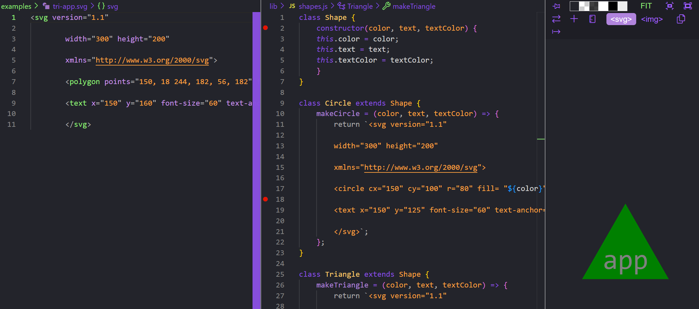

# Logomaker10

## Description

This is a SVG shape maker. Its direct purpose is to create many different shapes with ease!

## Table of Contents

- [Installation](#installation)
- [Usage](#usage)
- [Credits](#credits)
- [License](#license)

## Installation

To use this SVG Logo maker you will need to start by cloning the repo
https://github.com/LindseyIsaac/Logomaker10 

Open in VS code and then open index.js in the integrated terminal, install node.js, 

After node.js is installed in the terminal you will use the command npm init -y to initialize and create a package.json where project files will be stored. 

After this is done in the terminal type npm i to install the dependencies. 

To run the application in the terminal you will ned to type the command node index.js 

## Usage

https://drive.google.com/file/d/1j7e6BdibeNVUmBIKfDYyfbVargTx1yq5/view
## Tests    
To run the tests type npm run test into the terminal.
## Credits

***M Vincent Richards*** https://github.com/vrich88 
***Matt Montiel*** https://github.com/MatthewMontiel 
***Danny Cohen*** https://github.com/dctristero 
***TA assistance from Derek*** 
***Tutor help from: Robbie Kurl***  

## License

MIT License

Copyright (c) 2023 Lindsey

